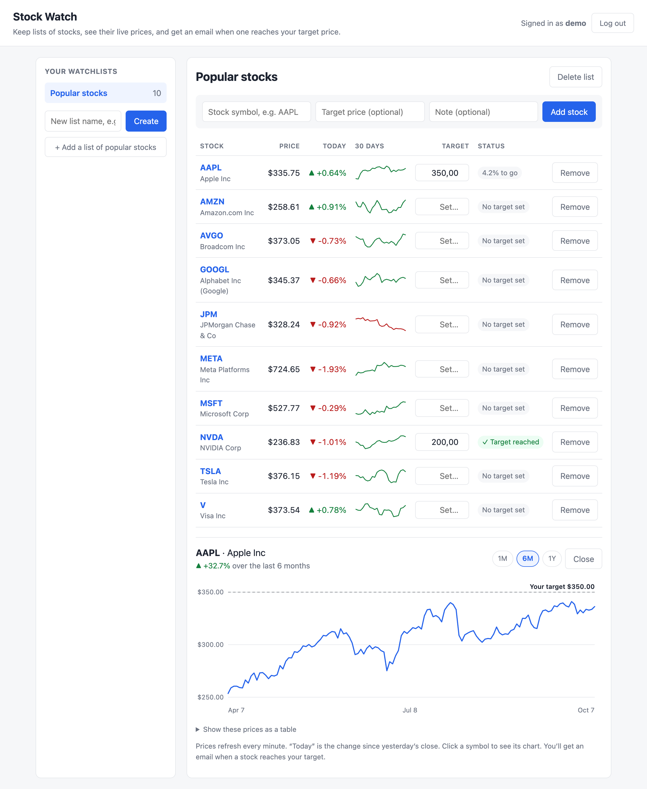

# Stock Watch

A small Django app for keeping watchlists of stocks. It shows live prices and 30-day trends, and emails you when a stock reaches the target price you set.

**Live site:**(https://stock-watch-uxfb.onrender.com)(free tier: the first visit after 15 idle minutes takes 30–60 seconds while it wakes up)



- **Watchlists:** group stocks into named lists (e.g. "Tech", "Long term"). Each account sees only its own lists.
- **Example list:** one click adds a "Popular stocks" list with 10 of the largest US companies (Apple, Microsoft, NVIDIA, Alphabet, Amazon, Meta, Broadcom, Tesla, JPMorgan Chase, Visa). Each person gets their own copy to edit. The list is defined in `watchlist/examples.py`.
- **Live prices:** current price and today's change from [Finnhub](https://finnhub.io), or Yahoo Finance when no Finnhub key is set. The company name is filled in automatically.
- **Charts:** a 30-day sparkline for every stock. Click a symbol for a 1-month / 6-month / 1-year chart with your target marked.
- **Alerts:** one email when a stock reaches your target. The alert re-arms if the price drops back below the target or you change the target.
- **REST API:** everything the page does is also available at `/api/` (Django REST Framework).

## Setup

You need Python 3.11 or newer.

```bash
python3 -m venv .venv
source .venv/bin/activate
pip install -r requirements-dev.txt
cp .env.example .env          # then edit .env (see below)
python manage.py migrate
python manage.py createcachetable   # the database table that caches prices
python manage.py runserver
```

Open http://127.0.0.1:8000/ and create an account. The first account to sign up takes over any watchlists that were created before accounts existed.

## Configuration (`.env`)

| Setting | What it's for |
|---|---|
| `SECRET_KEY` | Django's own secret, used to sign login cookies. Generate one with `python -c "from django.core.management.utils import get_random_secret_key as g; print(g())"`. |
| `DEBUG` | `1` while developing on your computer. `0` anywhere public. |
| `ALLOWED_HOSTS` | Hostnames the site may be served under, comma-separated. |
| `FINNHUB_API_KEY` | Free key from finnhub.io for prices and company names. Optional: without it, Yahoo Finance is used. |
| `EMAIL_HOST_USER`, `EMAIL_HOST_PASSWORD` | Email account that sends alerts. For Gmail, use an [App Password](https://myaccount.google.com/apppasswords), not your normal password. Leave them empty and emails are printed in the terminal instead. |
| `SITE_URL` | The link included in alert emails. |
| `DATABASE_URL` | Production only: a PostgreSQL URL. When it's not set, the local `db.sqlite3` is used. |
| `HTTPS` | Production only: `1` turns on secure cookies, the https redirect and HSTS. |
| `CSRF_TRUSTED_ORIGINS` | Production only: extra `https://` origins allowed to submit forms. Render's own URL is added automatically. |

`.env` holds secrets, and git ignores it. Never commit it.

## Target-price alerts

Alerts are sent by a separate command. Run it in a second terminal next to the web server:

```bash
python manage.py check_alerts --every 5     # check every 5 minutes; Ctrl+C to stop
python manage.py check_alerts               # check once (e.g. from cron)
```

## API

All endpoints need a logged-in user. Lists are paginated, 20 per page.

| Endpoint | Description |
|---|---|
| `GET /api/watchlist` | **Every ticker on your lists, with its latest price and daily change, as one flat list.** The summary endpoint. |
| `GET/POST /api/watchlists/` | Your watchlists, each with its items |
| `GET/PATCH/DELETE /api/watchlists/<id>/` | One watchlist |
| `POST /api/watchlists/example/` | Add the "Popular stocks" example list, or get the one you already have |
| `GET/POST /api/items/?watchlist=<id>` | Stocks on your lists: target price, `target_reached`, notes |
| `PATCH/DELETE /api/items/<id>/` | Change a target or note, or remove a stock from a list |
| `GET/POST /api/stocks/?symbol=AAPL` | The shared stock list, with `current_price` and `day_change_pct`. Editing and deleting stocks is admin-only. |
| `GET /api/stocks/<id>/history/?range=1mo\|6mo\|1y` | Daily closing prices |

The admin site is at `/admin/`. Create an admin account with `python manage.py createsuperuser`.

## Data sources & limits

- **Prices and company names** come from [Finnhub](https://finnhub.io). The free plan allows about **60 requests per minute** and is for **personal, non-commercial use**. Check their current terms before using it for anything else.
- **Staying under the limit:** quotes are **cached in the database** (Django's database cache, table `cache_table`) for 60 seconds. Failed lookups are cached for 5 minutes, and a page asks for each symbol only once, in parallel. Because the cache lives in the database, it survives restarts and is shared by every server process.
- **Price history (charts)** comes from Yahoo Finance through the `yfinance` library, because Finnhub's free plan doesn't include historical prices. This is unofficial Yahoo data, not a supported API, so it can break or be rate-limited. If no Finnhub key is set, Yahoo is also used for current prices.
- **When a source fails** (timeout, error, rate limit, unknown symbol), the app shows "no price" instead of crashing. The tests in `watchlist/tests/test_api_failures.py` check every one of these cases.
- **Delays:** prices may be delayed and stay at the last close while the market is shut.

## Deploying to Render

`render.yaml` sets up a free web service plus a free PostgreSQL database.

1. Push this repo to GitHub. `.env` and `db.sqlite3` are git-ignored and stay on your computer.
2. In Render, choose **New → Blueprint** and pick the repo. Paste your Finnhub key when it asks for `FINNHUB_API_KEY`.
3. Render installs the packages, runs `collectstatic`, `migrate` and `createcachetable`, then starts `gunicorn`. `SECRET_KEY` is generated for you, `DEBUG` is off and HTTPS is on.
4. Open the URL Render gives you, create an account, and click through.

**Free-tier caveats** (checked October 2026; plans change, so check Render's pricing page):
- The web service sleeps after 15 minutes without visitors.
- The free PostgreSQL database is 1 GB with **no backups**, and it **expires 30 days after creation** unless upgraded.
- Free web services can't run a background process, so `check_alerts --every` doesn't run on the free plan. Alerts work locally, or on Render with a paid cron job running `python manage.py check_alerts`.

## Development

```bash
pytest            # run the tests (no internet needed: price lookups are faked)
ruff check .      # lint
```

GitHub Actions runs both on every push (`.github/workflows/tests.yml`).

Prices come from free data sources. They can be delayed by up to about 15 minutes, and they stay at the last close while the market is shut.
